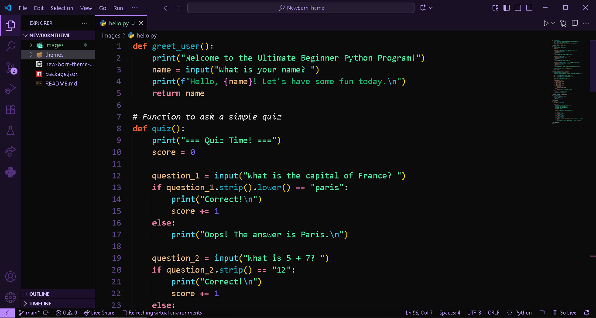

# NewbornTheme

A sleek, modern, and minimal dark theme for Visual Studio Code. Designed to reduce eye strain and make your code more readable while keeping a vibrant look for syntax highlighting.

 <!-- Add a screenshot later -->

---

## Features ✨

- Dark background for comfortable coding during long hours
- Vibrant syntax highlighting for keywords, variables, strings, and comments
- Subtle sidebar, activity bar, and status bar colors for distraction-free coding
- Optimized for readability and aesthetics

---

## Installation 🚀

There are two ways to install the theme:

### 1. From Visual Studio Marketplace

1. Go to the [Visual Studio Marketplace](https://marketplace.visualstudio.com/manage) page for this theme.
2. Click **Install**.
3. Open VS Code → Press `Ctrl+K Ctrl+T` → Select **My Cool Theme**.

### 2. From VSIX file (Manual)

1. Download the `.vsix` file from releases.
2. In VS Code, press `Ctrl+Shift+P` → Type **Install from VSIX** → Select the file.
3. Activate the theme via `Ctrl+K Ctrl+T`.

---

## Customization 🎨

You can customize colors by editing `themes/MyCoolTheme-color-theme.json`.  
For example, change editor background:

```json
"editor.background": "#1E1E1E"
